# Architecture Diagram: Classroom Presentation Randomizer

## System Architecture

```mermaid
graph TB
    subgraph "User Layer"
        User[👤 Instructor/TA Browser]
    end

    subgraph "Vercel Edge Network"
        Edge[🌐 Vercel Edge CDN<br/>SSL/TLS Termination]
    end

    subgraph "Application Layer (Vercel)"
        Frontend[⚛️ Next.js Frontend<br/>React Components]
        API[🔧 Next.js API Routes<br/>Serverless Functions]
    end

    subgraph "Data Layer"
        DB[(🗄️ Vercel Postgres<br/>Neon Serverless)]
    end

    subgraph "CI/CD Pipeline"
        GitHub[📦 GitHub Repository<br/>Source Code]
        Actions[⚙️ GitHub Actions<br/>Workflow Automation]
        Deploy[🚀 Vercel Deployment<br/>Auto-deploy on Push]
    end

    subgraph "Secrets Management"
        GHSecrets[🔐 GitHub Secrets<br/>VERCEL_TOKEN, ORG_ID]
        VSecrets[🔐 Vercel Env Vars<br/>JWT_SECRET, POSTGRES_URL]
    end

    %% Data Flow (Request/Response)
    User -->|HTTPS Request| Edge
    Edge -->|Route| Frontend
    Frontend -->|API Call| API
    API -->|SQL Queries| DB
    DB -->|Query Results| API
    API -->|JSON Response| Frontend
    Frontend -->|HTML/CSS/JS| Edge
    Edge -->|HTTPS Response| User

    %% Deployment Flow
    GitHub -->|Push/Tag| Actions
    Actions -->|Deploy Command| Deploy
    Deploy -->|Update| Frontend
    Deploy -->|Update| API

    %% Secrets Flow
    GHSecrets -.->|Inject| Actions
    Actions -.->|Pass to| Deploy
    VSecrets -.->|Runtime Inject| API

    style User fill:#e1f5ff
    style Edge fill:#ffe1e1
    style Frontend fill:#e1ffe1
    style API fill:#fff4e1
    style DB fill:#f0e1ff
    style GitHub fill:#e1e1e1
    style Actions fill:#ffe1f4
    style Deploy fill:#e1fff4
```

## Component Descriptions

### User Layer
- **Browser**: Instructors and TAs access the application via HTTPS
- **Authentication**: JWT tokens stored in httpOnly cookies

### Vercel Edge Network
- **CDN**: Global content delivery network
- **SSL/TLS**: Automatic HTTPS certificate management
- **Routing**: Intelligent routing to nearest edge node

### Application Layer
- **Next.js Frontend**:
  - React 18 components with TypeScript
  - Tailwind CSS for styling
  - Client-side state management (useState, useEffect)
  - Pages: Dashboard, Setup, Presentation, History

- **Next.js API Routes**:
  - Serverless functions (auto-scaling)
  - JWT authentication middleware
  - Business logic for sessions, teams, presentations, grading
  - RESTful endpoints for all operations

### Data Layer
- **Vercel Postgres (Neon)**:
  - Serverless PostgreSQL database
  - 10 tables: users, sessions, teams, presentations, grades, etc.
  - ACID transactions for data integrity
  - Automatic backups and scaling

### CI/CD Pipeline
- **GitHub Repository**: Source control with branch protection
- **GitHub Actions**: Automated workflow on git tags (e.g., v1.0.0)
- **Vercel Deployment**: Zero-downtime deployments with instant rollback

### Secrets Management
- **GitHub Secrets**: VERCEL_TOKEN, VERCEL_ORG_ID, VERCEL_PROJECT_ID
- **Vercel Environment Variables**: JWT_SECRET, POSTGRES_URL
- **Security**: Never committed to source code, injected at runtime

## Data Flow (User Request)

1. User sends HTTPS request from browser
2. Vercel Edge Network routes to nearest edge node
3. Edge node serves cached static assets or forwards to frontend
4. Next.js frontend renders React components
5. Frontend makes API call to Next.js API route
6. API route validates JWT, processes business logic
7. API route queries Postgres database
8. Database returns query results
9. API route sends JSON response
10. Frontend updates UI with new data
11. Edge network caches response (if applicable)
12. User receives updated page

## Deployment Flow (CI/CD)

1. Developer commits code to GitHub repository
2. Developer creates git tag (e.g., `git tag v1.0.0`)
3. GitHub Actions workflow triggers on tag push
4. GitHub Actions injects secrets (VERCEL_TOKEN, etc.)
5. GitHub Actions calls Vercel deployment API
6. Vercel builds Next.js application
7. Vercel injects environment variables (JWT_SECRET, POSTGRES_URL)
8. Vercel deploys to production with zero downtime
9. Live URL updates with new version

## Technology Stack

| Layer | Technologies |
|-------|-------------|
| Frontend | Next.js 15, React 18, TypeScript, Tailwind CSS |
| Backend | Next.js API Routes (Node.js), jose (JWT), bcryptjs |
| Database | PostgreSQL (Vercel Postgres via Neon) |
| Deployment | Vercel (serverless), GitHub Actions |
| Security | JWT with httpOnly cookies, bcrypt password hashing |

## Scalability Considerations

- **Current Capacity**: 0-100 concurrent users (free tier)
- **Horizontal Scaling**: Next.js API routes auto-scale
- **Vertical Scaling**: Postgres can upgrade to larger instances
- **Edge Network**: Global CDN for low latency
- **Future**: Can add Redis caching, read replicas, CDN for assets

## Security Features

- **HTTPS Everywhere**: All traffic encrypted with TLS
- **JWT Authentication**: httpOnly cookies prevent XSS
- **Password Hashing**: bcrypt with salt rounds
- **SQL Injection Prevention**: Parameterized queries
- **Secret Management**: Environment variables, never in source code
- **Automated Patching**: Vercel manages infrastructure updates
